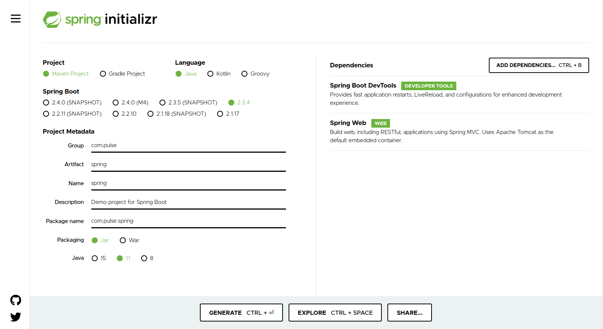
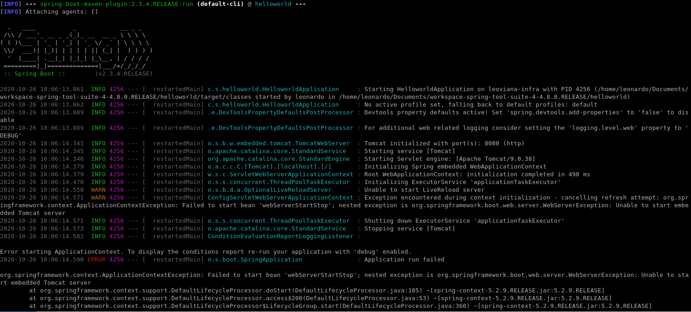
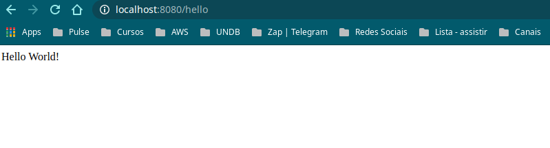

## Projeto Hello World com Springframework

```
Crinado um projeto com Springframework
```

## Ferramentas

```
- Eclipse IDE for JAVA EE Developers;
- Spring Initializr (http://start.spring.io);
- Springframework;
- Maven;
- Java;
```
## Criando o projeto spring através do start.spring.io



- Conteúdo:

```
- Tipo do projeto: Maven 
- Linguagem: Java
- Versão do SpringBoot: 2.3.4
- Metadata do projeto: 
    - Grupo: com.pulse;
    - Artifact: spring;
    - Nome: spring; 
    - Descrição: Projeto SpringBoot;
    - Package Name: com.pulse.spring;
    - Packaging: Jar;
    - Versão do Java: 11;
- Dependências: 
    - Spring Web;
    - Spring DevTools;
```
- Ao finalizar, basta gerar o projeto, descopactar no diretório desejado e abrir com a IDE.

## Projeto Spring 

- O projeto ja vem com uma classe principal definida

```
package com.springboot.helloworld;

import org.springframework.boot.SpringApplication;
import org.springframework.boot.autoconfigure.SpringBootApplication;

@SpringBootApplication
public class HelloworldApplication {

	public static void main(String[] args) {
		SpringApplication.run(HelloworldApplication.class, args);
	}
	
}
```

## Implementando o código

```
package com.springboot.helloworld;

import org.springframework.boot.SpringApplication;
import org.springframework.boot.autoconfigure.SpringBootApplication;
import org.springframework.web.bind.annotation.GetMapping;
import org.springframework.web.bind.annotation.RequestParam;
import org.springframework.web.bind.annotation.RestController;

@SpringBootApplication
@RestController
public class HelloworldApplication {

	public static void main(String[] args) {
		SpringApplication.run(HelloworldApplication.class, args);
	}

	@GetMapping("/hello")
	public String hello(@RequestParam(value = "name", defaultValue = "World") String name) {
		return String.format("Hello %s!", name);
	}

}
```
## Rodando o projeto

```
./mvnw spring-boot:run
```


## Acessando o projeto (http://localhost:8080/hello)




